# capturepack

## Can you explain a bug in under 5 seconds?

**CapturePack is the fastest way to explain something to an LLM.**

> Capture context, not screenshots.
>
> Better input. Better answers.

CapturePack is an open-source context capture format and toolkit that helps humans and AI understand visual problems beyond screenshots and screen recordings.

🌐 **[capturepack.dev](https://capturepack.dev)** · [Download](https://github.com/r2cuerdame/capturepack/releases/latest)

<p align="center">
  
</p>

A `.capturepack` file bundles what a screenshot cannot: the last 30 seconds of replay, a snapshot, editable annotations, a machine-readable event timeline, and a human-readable report — everything another developer or any LLM needs to immediately understand the situation.

## The 5-second workflow

```
Ctrl+Alt+C  →  capture  →  5-second annotation  →  export  →  drop into
                                                              ChatGPT / Claude / Codex / Cursor / Gemini
                                                              or send to another developer
```

## Why

- **Screenshots preserve pixels.** You lose what happened before the frame.
- **Videos preserve motion.** You lose intent and structure.
- **CapturePack preserves context.** Time, space, intent, environment.

## Principles

Local first · Offline first · Open format · Plugin based · No cloud · No login · No database · No AI dependency · No vendor lock-in.

Generated CapturePacks should remain readable forever.

## What's inside a `.capturepack`

```
example.capturepack  (a standard ZIP — or the same tree as a plain directory)
├── manifest.json       # REQUIRED  format version, environment, inventory
├── snapshot.png        # REQUIRED  the captured frame
├── replay.webm         # OPTIONAL  last ~30 s of replay (or replay.mp4)
├── annotations.json    # OPTIONAL  editable annotations (never burned into video)
├── timeline.json       # OPTIONAL  machine-readable event log
├── report.md           # OPTIONAL  human/LLM-readable summary
└── plugins/            # OPTIONAL  structured metadata appended by plugins
```

A screenshot-only pack — `manifest.json` + `snapshot.png`, nothing else — is fully valid.

The specification matters more than any implementation — any language can generate CapturePack files. See [SPEC.md](SPEC.md).

## MCP — talk to your captures

The app ships an always-on, read-only [MCP](https://modelcontextprotocol.io) server at `http://127.0.0.1:39393/mcp` (localhost only), so any AI can find and analyze your latest pack by itself — "Analyze the latest CapturePack." is the whole prompt.

```
claude mcp add --transport http capturepack http://127.0.0.1:39393/mcp
```

Tools, client setup, and settings: [docs/MCP.md](docs/MCP.md).

## Status

Early development. See [GOAL.md](GOAL.md) for the project vision and [ROADMAP.md](ROADMAP.md) for what's next.

## License

[MIT](LICENSE)
